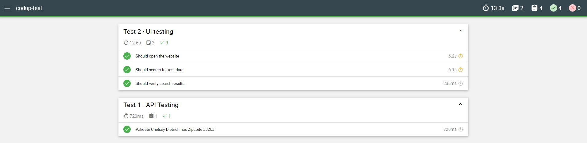

<!-- Codup LOGO -->
<br />
<h1>
<p align="center">
  
  <br>Codup Test
</h1>
  <p align="center">
    Automation Framework to automate test scenarios for Codup Technical Test.
    <br />
    </p>
<p align="center">
  <a href="#about-the-project">About Codup Test</a> •
  <a href="#installation">How To Setup</a> •
  <a href="#best-practices">Best Practices</a> •
  <a href="#contributors">Contributors</a> •
  <a href="LICENSE.md">License</a>
</p>

<p align="center">


 
</p>
                          
## About Codup Test
Codup Test is developed with Cypress and JavaScript. The goal of this framework to provide structure and guideline to automate all possible test scenarios related to Codup Technical Test.

### Repository

Clone from GitHub:

```
git clone https://github.com/mtafseerhaider/codup-test.git

```

## How To Setup

```npm
cd /codup-test
npm install
```

## Best Practices

I have built this framework using the industry standard design patterns such as SOLID principles, Page Object Model, and other best practices to make sure the framework is robust, reusable, scalable and maintainable.
For writing test scenarios using this framework, I recommend you to follow the best practices by Cypress: https://docs.cypress.io/guides/references/best-practices

## Contributors

- [@mtafseerhaider](https://github.com/mtafseerhaider/mtafseerhaider)
